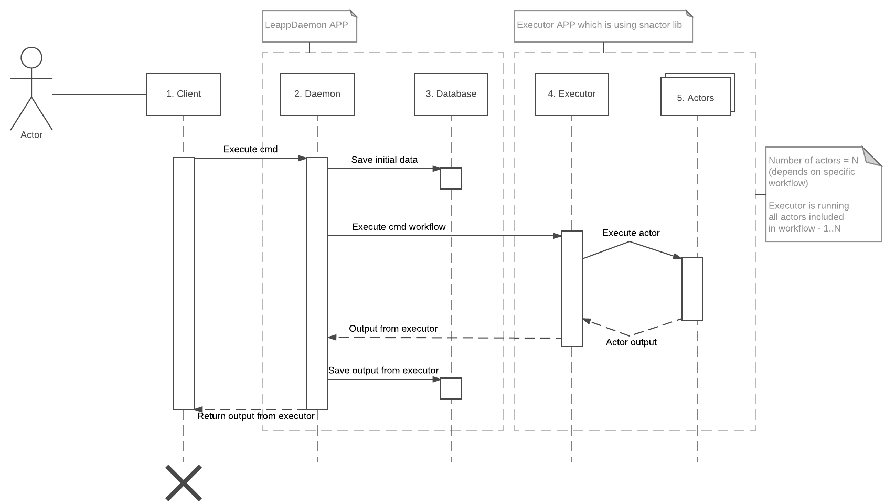

## Architecture overview

### Execution flow

#### Legend 
1. **Client**
 
   Face of the LeApp - Client can be web UI (cockpit plugin) or shell client, both communicate with Daemon over HTTP protocol.

   You can execute specific commands (with custom options) and then read the output after execution.

2. **Daemon**
   
   Daemon exposes HTTP endpoints for Client. It runs Executor and save information about executed commands in Database.

   In simple words we can say this a bridge between Client and Executor, heart of LeApp.

   Because of daemon-centric architecture we are able to use async calls easier than before and data exchange flow is much simpler.

3. **Database**

   Simple SQLite3 database, it keeps information about executed commands and store output from them.

   By keeping information in database we are able to build migrations history.
   Those kind of information are not only useful for end-users, it is also useful for contributors to analyze migration process and improve it in the future.

4. **Executor**
   
   Daemon passes specific workflow to Executor and the Executor then is able to run bunch of actors defined in one workflow.

   What is workflow? Think about it as step-by-step recipe to achieve desired result.
   For example if you want to build a house you might have workflow like that: 
   1. build foundations
   2. build walls 
   3. build roof

   So right now switch your mind to OS context, what kind of workflow do you need to move LAMP stack to macro-container or micro-containers environment?

   Tip - think about:
    1. OS configuration
    2. Apps dependencies
    3. Apps config files
    4. Network (open ports, firewall rules etc.)
    5. Data

5. **Actors**

   Actor is self contained unit which is handling specific aspect of given workflow.

   As example, if you want to migrate any network service, one of the needed step is to check all used ports.
   That bring us to prepare PortScanner actor, it can be simple python script which is scanning ports.

   You might also want to migrate your network service to Open Shift environment.
   The result of above idea should be OpenShiftDeployment actor,
   it can be script which is using Open Shift API to deploy given app.

   To get deep knowledge how to create your own actors visit: [link](https://github.com/leapp-to/leapp-actors)
